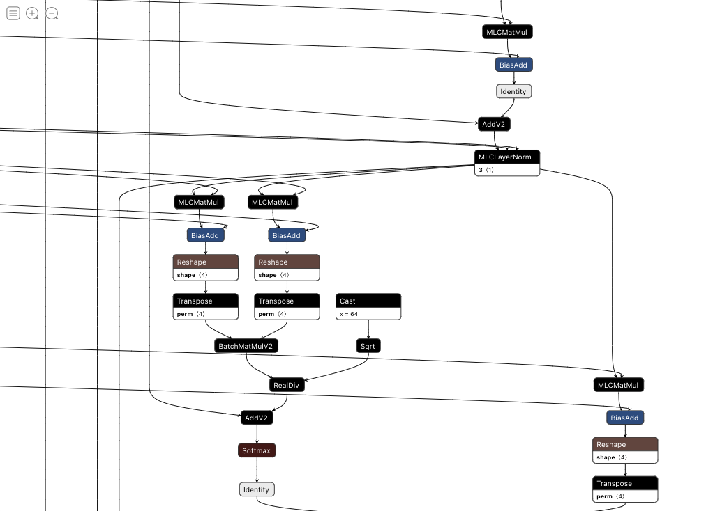

# Apple-M1-BERT Inference


### Setup Environment:

1. Install Miniforge from their official [page] (https://github.com/conda-forge/miniforge/releases/latest/download/Miniforge3-MacOSX-arm64.sh)

Once downloaded:

```
chmod +x ~/Downloads/Miniforge3-MacOSX-arm64.sh
sh ~/Downloads/Miniforge3-MacOSX-arm64.sh
source ~/miniforge3/bin/activate
```

2. Create an environment for TVM and all dependencies to run this repo:

```
# Create a conda environment
conda create --name tvm-m1 python=3.8
conda activate tvm-m1

# Install TensorFlow and dependencies
conda install -c apple tensorflow-deps
python -m pip install tensorflow-macos
python -m pip install tensorflow-metal

# Install PyTorch and Transformers
conda install -c pytorch pytorch torchvision
conda install -c huggingface transformers -y

# Install TVM dependencies
conda install numpy decorator attrs cython
conda install llvmdev
conda install cmake
conda install tornado psutil xgboost cloudpickle pytest
```

3. Clone and Build TVM

Clone TVM

```
git clone --recursive https://github.com/apache/tvm tvm
cd tvm && mkdir build
cp cmake/config.cmake build
```

Edit the `config.cmake` file in the build directory setting the following

```
USE_METAL ON
USE_LLVM ON
USE_OPENMP gnu
```

Build TVM

```
make -DCMAKE_OSX_ARCHITECTURES=arm64 ..
```

Set the following environment variables or add to `~/.zshrc` for persistency:

```
export TVM_HOME=/Users/tvmuser/git/tvm
export PYTHONPATH=$TVM_HOME/python:${PYTHONPATH}
```

**For more details on setting up TensorFlow on MacOS click [here](https://developer.apple.com/metal/tensorflow-plugin/)**

### Run the TF and Keras benchmarks:

1. Dump `bert-base-uncased` model into a graph by running `python dump_tf_graph.py`.
2. Get Keras CPU benchmark by running `python run_keras.py --device cpu`. Sample output: `[Keras] Mean Inference time (std dev) on cpu: 579.0056343078613 ms (20.846548561801576 ms)`
3. Get Keras GPU benchmark by running `python run_keras.py --device gpu`. Sample output: `[Keras] Mean Inference time (std dev) on gpu: 1767.4337482452393 ms (27.00876036973127 ms)`
4. Get CPU benchmark by running `python run_graphdef.py --device cpu --graph-path ./models/bert-base-uncased.pb`. Sample output: `[Graphdef] Mean Inference time (std dev) on cpu: 512.3187007904053 ms (6.115432898641167 ms)`
5. Get GPU benchmark by running `python run_graphdef.py --device gpu --graph-path ./models/bert-base-uncased.pb`. Sample output: `[Graphdef] Mean Inference time (std dev) on gpu: 543.5237417221069 ms (4.210226676450006 ms)`

### Running TVM AutoScheduler Search

We have provided `search_dense_cpu.py` and `search_dense_gpu.py` for searching on M1 CPUs and M1 GPUs. Both scripts are using RPC. You should run each of these commands in separate windows or use a session manager like `screen` or `tmux` for each command.

The scripts require that you have converted HuggingFace's `bert-base-uncased` model to relay. This can be done via the `dump_pt.py` script.


1. Start RPC Tracker: `python -m tvm.exec.rpc_tracker --host 0.0.0.0 --port 9190`
2. Start RPC Server: `python -m tvm.exec.rpc_server --tracker 127.0.0.1:9190 --port 9090 --key m1 --no-fork`

Before continuing make sure all existing logs have been removed from the `./assets` folder.

Once the scripts have completed you should see an output like this:

```
Extract tasks...
Compile...
Upload
run
Evaluate inference time cost...
Mean inference time (std dev): 35.54 ms (1.39 ms)
```

### Running TVM Inference
If you decide not to run a search and use the provided pre-searched logs from AutoScheduler in `assets` folder for the M1Pro CPU and GPU comment out the following:

```
    if not os.path.exists(log_file):
        tasks, task_weights = auto_scheduler.extract_tasks(
            mod["main"], params, target=target_host, target_host=target_host)
        for idx, task in enumerate(tasks):
            print("========== Task %d  (workload key: %s) ==========" %
                  (idx, task.workload_key))
            print(task.compute_dag)

        run_tuning(tasks, task_weights, log_file)
```


### Why is TVM much faster than Apple TensorFlow with MLCompute?
- TVM AutoScheduler is able to using machine learning to search out CPU/GPU code optimization; Human experts are not able to cover all optimizations.
- TVM is able to fuse any subgraphs qualified of computation nature and directly generate code for the target; Human experts are only able to manually add fusing patterns, manually optimize certain subgraph.
- We visualized `bert-base-uncased` graph in Apple TensorFlow. Here is a sample block in BERT. 
  As we can see, MLCompute tried to rewrite a TF graph, replace some operators to what it [supports](https://developer.apple.com/documentation/mlcompute/layers)
  In real practice perfect covert is alway hard, in BERT case, we can see `MatMul` operator is swapped to `MLCMatMul`, `LayerNorm` operator is swapped to `MLCLayerNorm`, while all others operators are not covered by MLCompute. In GPU case, data is copied between CPU and GPU almost in every step. On the other hand, TVM directly generates ALL operators on GPU, so it is able to maximize gpu utilization.


If you'd like to learn more about TVM please visit our Apache Project [site](https://tvm.apache.org/) or the [OctoML](https://octoml.ai/) site as well as our OctoML's [blog](https://octoml.ai/blog/). 